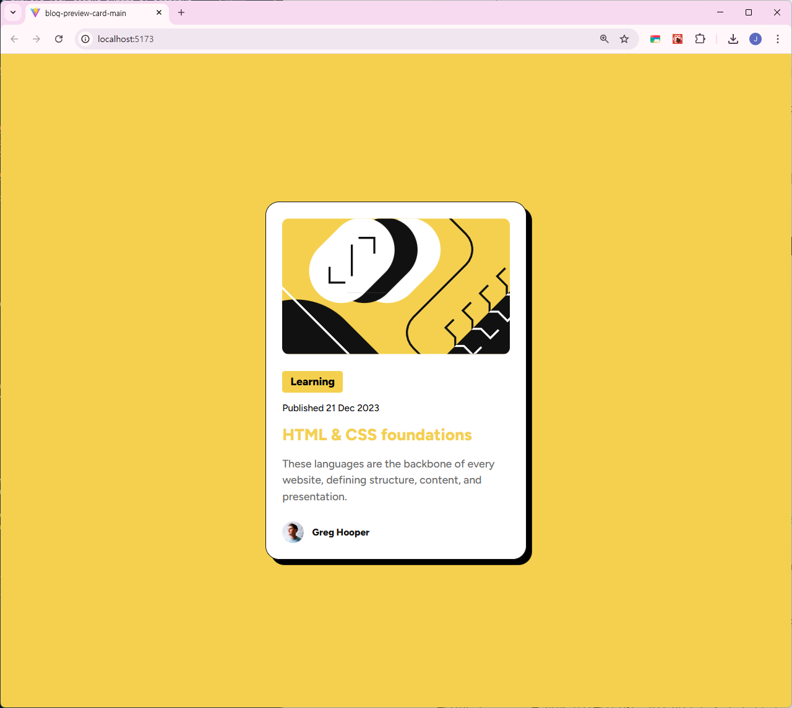

# Frontend Mentor - Blog preview card solution

This is a solution to the [Blog preview card challenge on Frontend Mentor](https://www.frontendmentor.io/challenges/blog-preview-card-ckPaj01IcS). Frontend Mentor challenges help you improve your coding skills by building realistic projects. 

## Table of contents

- [Overview](#overview)
  - [The challenge](#the-challenge)
  - [Screenshot](#screenshot)
  - [Links](#links)
- [My process](#my-process)
  - [Built with](#built-with)
  - [What I learned](#what-i-learned)

## Overview

### The challenge

Users should be able to:

- See hover and focus states for all interactive elements on the page

### Screenshot




### Links

- Solution URL: [Github](https://github.com/umnoni/blog-preview-card-main)
- Live Site URL: [Versel](https://blog-preview-card-main-one-beta.vercel.app/)

## My process

### Built with

- [React](https://reactjs.org/) - JS library
- [Tailwind CSS](https://tailwindcss.com/)

### What I learned

- Hard Shadow Implementation
```jsx
  <div className="shadow-[8px_8px_0px_0px_rgba(0,0,0,1)]">
```
- Interactive States (Hover)
```jsx
  <h1 className="hover:text-[#F4D04E] transition-colors cursor-pointer">
```
- Custom Font Implementation
```jsx
  <p className="font-[Figtree-Medium]">
```